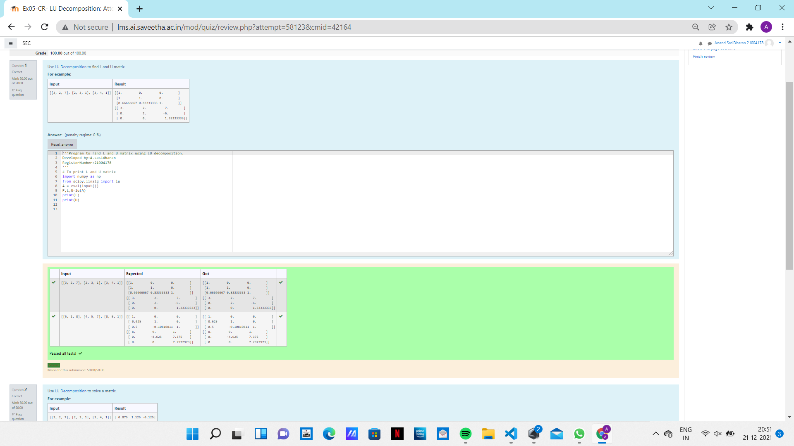
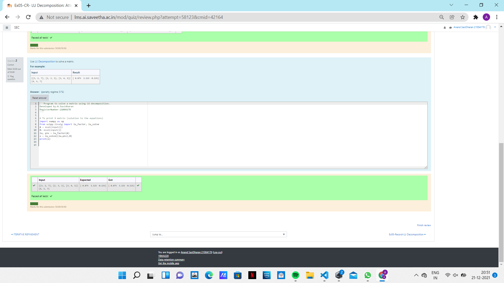

# LU Decomposition without zero on the diagonal

## AIM:
To write a program to find the LU Decomposition of a matrix.

## Equipments Required:
1. Hardware – PCs
2. Anaconda – Python 3.7 Installation / Moodle-Code Runner

## Algorithm
1. Define a function.
2. Assign number_iters = 100 in the function to perform 100 iteratios.
3. Set i = 0.
4. Calculate number = 0.5 * (number + a / number) for 100 iterations.
Return number

## Program:
```
/*
Program to find L and U matrix using LU decomposition.
Developed by:A.sasidharan 
RegisterNumber:21004178 

# To print L and U matrix
import numpy as np
from scipy.linalg import lu
A = eval(input())
P,L,U=lu(A)
print(L)
print(U) 
*/
```

## Output:


## Program:
```
/*
Program to solve a matrix using LU decomposition.
Developed by:A.Sasidharan
RegisterNumber:21004178 


# To print X matrix (solution to the equations)
import numpy as np
from scipy.linalg import lu_factor, lu_solve
A = eval(input())
B= eval(input())
lu, piv = lu_factor(A)
x = lu_solve((lu,piv),B)
print(x)
*/
```


## Output:


## Result:
Thus the program to find the LU Decomposition of a matrix is written and verified using python programming.

